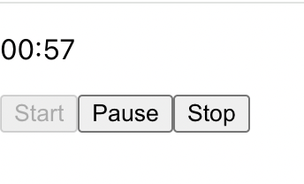

## Five Min Timer

This is a quick react practice challenge from reactpractice.dev:

Create a 5 minute countdown timer that can be started and stopped.

When the page is first loaded, the counter displays 05:00
When the user clicks "Start", the counter starts counting down.
When the user clicks "Pause", the counter stops counting down, but still displays how much time is left. Clicking "Start" should start the counter again from where it was paused.
When the user clicks "Stop", the timer should stop elapsing time and reset.

## Project Screen Shot(s)

#### Example:   

## Installation and Setup Instructions

- `npm install`
- `npm start`
- Visit http://localhost:3000

## Reflection

    This was an exercise to better understand using Refs in React as well as setInterval. 
